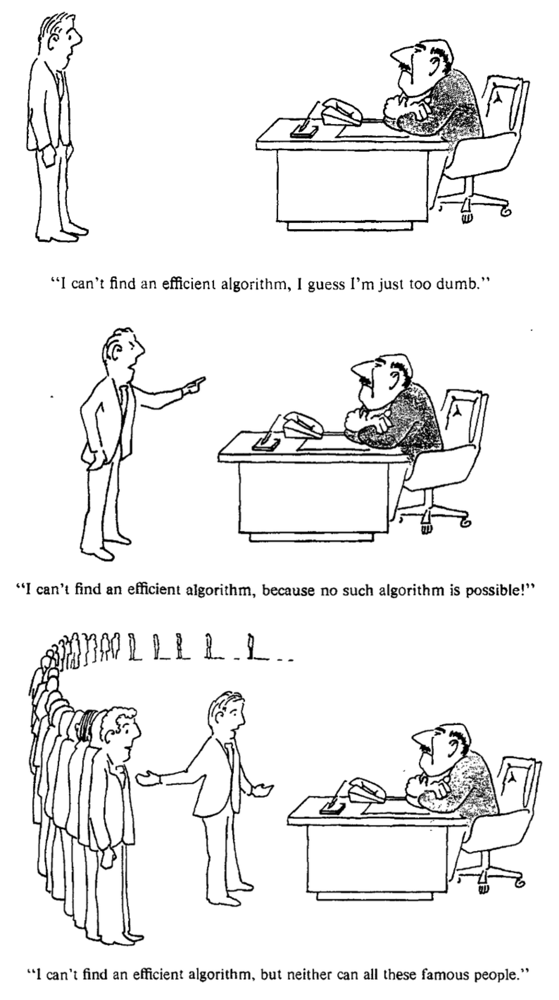

# Master's Thesis: Classical v/s Quantum Optimization: Comparison of Runtime Scaling
**Author**: Karthik Jayadevan

> [!NOTE]
> - [The full text of the thesis is uploaded as a PDF here](./[public]_mthes_comb_opt.pdf).
> - For a quick overview, see the [poster summarizing this work](./mthes_CO_Poster.pdf).
> - This work (completed as part of the M.Sc. degree programme) was awarded a grade of 1.3 (excellent) from the University of Freiburg.
> - The results from this work are currently in preparation for publication in the next version of the paper: [Extrapolation method to optimize linear-ramp QAOA parameters: Evaluation of QAOA runtime scaling](https://arxiv.org/abs/2504.08577)

## Abstract

The study of algorithms for combinatorial optimization has been a central focus of quantum computing research in recent years. The primary goal in this field is to develop efficient algorithms based on quantum mechanical principles, that can outperform (or more realistically, complement) classical algorithms for solving NP-hard problems. Setting up problem instances in the Quadratic Unconstrained Binary Optimization (QUBO) model, this thesis aims to compare the performance of classical algorithms like CPLEX, Goemans-Williamson and MQLib against two variants of the Linear Ramp Quantum Approximate Optimization Algorithm (LR-QAOA) on two combinatorial optimization problems: the Maximum Cut Problem (MaxCut) and a new resource allocation problem from the energy provider EnBW (which we refer to as the TA problem).

The first variant of LR-QAOA, which we refer to as normalized Hamiltonian LR-QAOA, sets up instance-agnostic parameters for the algorithm for all problem sizes, while the second variant, which we refer to as extrapolation LR-QAOA, determines suitable LR-QAOA parameters for each problem instance by heuristically extrapolating from smaller sub-instances.

For both the classical and quantum algorithms, we investigate how the runtime of each of the algorithms scales with the problem size for both problems, and how the solution quality compares across algorithms.

---
<figure>
  
  <figcaption style="text-align: center;">A comic strip from the famous textbook <em>Computers and intractability: a guide to the theory of NP-completeness</em> (Garey & Johnson, 2009) on finding efficient algorithms for optimization problems</figcaption>
</figure>
